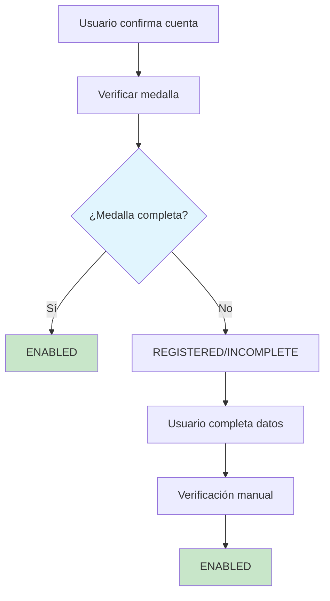

# 🚀 Implementación de Verificación Automática de Medallas

## 📋 Resumen

**Fecha**: 2025-01-27  
**Estado**: ✅ **IMPLEMENTADO**  
**Objetivo**: Automatizar la verificación de medallas completas para evitar medallas atrapadas en estado REGISTERED

## 🎯 Problema Resuelto

### **Antes (Problemático)**
```
Usuario confirma cuenta → REGISTERED → ❌ Medalla atrapada
```

### **Después (Solucionado)**
```
Usuario confirma cuenta → Verificación automática → ENABLED/INCOMPLETE
```

## 🔧 Implementación

### **1. Método de Verificación**

**Archivo**: `backend-vlad/src/auth/auth.service.ts`

```typescript
/**
 * Verifica si una medalla tiene todos los datos necesarios para estar completamente funcional
 */
private isMedalComplete(medal: any): boolean {
    return !!(
        medal.petName && 
        medal.description && 
        medal.medalString && 
        medal.registerHash &&
        medal.petName.trim() !== '' &&
        medal.description.trim() !== ''
    );
}
```

### **2. Lógica Automática en confirmAccount()**

```typescript
// Obtener la medalla para verificar si está completa
const medal = await tx.medal.findUnique({
    where: { medalString: dto.medalString }
});

// Verificar si la medalla está completa
const isComplete = this.isMedalComplete(medal);

// Actualizar medalla según su estado de completitud
await tx.medal.update({
    where: { medalString: dto.medalString },
    data: {
        status: isComplete ? MedalState.ENABLED : MedalState.INCOMPLETE
    }
});

// Actualizar virgin medal
await tx.virginMedal.update({
    where: { medalString: dto.medalString },
    data: {
        status: isComplete ? MedalState.ENABLED : MedalState.REGISTERED
    }
});
```

## 🔄 Nuevo Flujo de Estados

### **Flujo Automático**



### **Estados Resultantes**

| Condición | Medal Status | Virgin Medal Status | Mensaje |
|-----------|--------------|-------------------|---------|
| **Medalla completa** | `ENABLED` | `ENABLED` | "user registered, medal enabled" |
| **Medalla incompleta** | `INCOMPLETE` | `REGISTERED` | "user registered, medal incomplete" |

## 📊 Datos Requeridos para Medalla Completa

### **Campos Obligatorios**
- ✅ `petName` (no vacío)
- ✅ `description` (no vacío)  
- ✅ `medalString` (obligatorio)
- ✅ `registerHash` (obligatorio)

### **Validaciones**
- ✅ Campos no pueden ser solo espacios en blanco
- ✅ Todos los campos deben existir
- ✅ Verificación automática en `confirmAccount()`

## 🛠️ Script de Migración

### **Archivo**: `backend-vlad/scripts/migrate-registered-medals.js`

**Propósito**: Migrar medallas REGISTERED existentes que estén completas a ENABLED

**Uso**:
```bash
cd backend-vlad
node scripts/migrate-registered-medals.js
```

**Funcionalidades**:
- 🔍 Busca medallas en estado REGISTERED
- ✅ Verifica si están completas
- 🚀 Migra automáticamente a ENABLED
- 📊 Reporta estadísticas de migración

## 🎯 Beneficios Implementados

### **1. Automatización**
- ✅ Medallas completas pasan automáticamente a ENABLED
- ✅ No más medallas atrapadas en REGISTERED
- ✅ Verificación inmediata al confirmar cuenta

### **2. Consistencia**
- ✅ Estados coherentes entre `medal` y `virginMedal`
- ✅ Flujo lógico y predecible
- ✅ Menos intervención manual requerida

### **3. Mejor UX**
- ✅ Usuario ve inmediatamente si su medalla está lista
- ✅ Mensajes claros sobre el estado de la medalla
- ✅ Proceso más fluido y automático

### **4. Mantenibilidad**
- ✅ Código más limpio y lógico
- ✅ Menos estados intermedios confusos
- ✅ Fácil debugging y monitoreo

## 📈 Impacto Esperado

### **Antes**
- ❌ Medallas atrapadas en REGISTERED
- ❌ Verificación manual requerida
- ❌ Estados inconsistentes
- ❌ Confusión en el flujo

### **Después**
- ✅ Verificación automática
- ✅ Estados consistentes
- ✅ Flujo claro y lógico
- ✅ Mejor experiencia de usuario

## 🏷️ Tags

`auto-verification` `medal-states` `user-experience` `automation` `bug-fix` `implemented`
