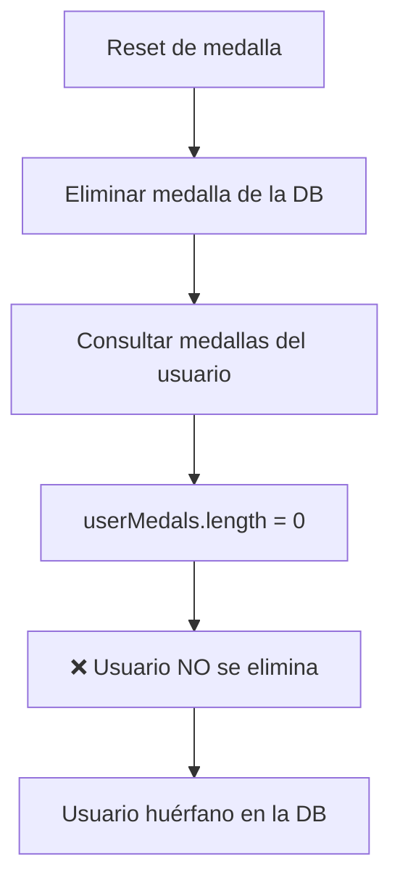
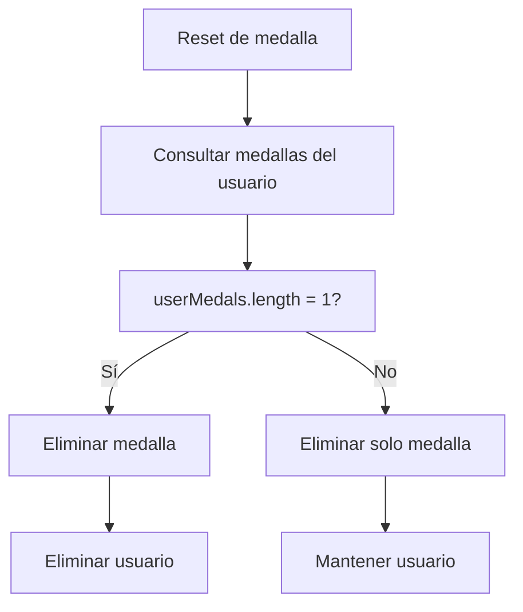

# 🐛 Bug Fix: Reset de Medalla No Eliminaba Usuario

## 📋 Resumen

**Fecha**: 2025-01-27  
**Severidad**: CRÍTICA  
**Estado**: ✅ SOLUCIONADO  

## 🔍 Descripción del Problema

Se identificó un bug crítico en el flujo de reset de medalla que impedía la eliminación correcta de usuarios cuando estos tenían una sola medalla. El problema estaba en el **orden de las operaciones** dentro de la transacción.

### Flujo Problemático



### Flujo Correcto



## 🛠️ Solución Implementada

### 1. Corrección del Orden de Operaciones

**Archivo**: `backend-vlad/src/qr-checking/qr-checking.service.ts`

**Cambios realizados**:

```typescript
// ANTES (problemático)
async processMedalReset(medalString: string, userEmail: string) {
    const result = await this.prisma.$transaction(async (prisma) => {
        // 1. Cambiar virgin medal a VIRGIN
        await prisma.virginMedal.update({...});

        // 2. Si existe medalla registrada, eliminarla
        if (registeredMedal) {
            await prisma.medal.delete({  // ⚠️ ELIMINAR PRIMERO
                where: { medalString }
            });

            // 3. Verificar si el usuario tiene otras medallas
            const userMedals = await prisma.medal.findMany({  // ⚠️ CONSULTAR DESPUÉS
                where: { ownerId: registeredMedal.ownerId }
            });

            // 4. Si es la única medalla, eliminar usuario
            if (userMedals.length === 1) {  // ⚠️ NUNCA será 1
                await prisma.user.delete({...});
            }
        }
    });
}

// DESPUÉS (corregido)
async processMedalReset(medalString: string, userEmail: string) {
    const result = await this.prisma.$transaction(async (prisma) => {
        // 1. Cambiar virgin medal a VIRGIN
        await prisma.virginMedal.update({...});

        // 2. Si existe medalla registrada, verificar si eliminar usuario
        if (registeredMedal) {
            // 3. Verificar medallas del usuario ANTES de eliminar
            const userMedals = await prisma.medal.findMany({  // ✅ CONSULTAR PRIMERO
                where: { ownerId: registeredMedal.ownerId }
            });

            // 4. Eliminar la medalla
            await prisma.medal.delete({  // ✅ ELIMINAR DESPUÉS
                where: { medalString }
            });

            // 5. Si era la única medalla, eliminar el usuario
            if (userMedals.length === 1) {  // ✅ AHORA SÍ FUNCIONA
                await prisma.user.delete({
                    where: { id: registeredMedal.ownerId }
                });
            }
        }
    });
}
```

### 2. Script de Identificación de Usuarios Huérfanos

**Archivo**: `backend-vlad/scripts/find-orphaned-users.js`

Este script identifica usuarios que no tienen medallas asociadas:

```bash
# Ejecutar el script
cd backend-vlad
node scripts/find-orphaned-users.js
```

### 3. Tests de Validación

**Archivo**: `backend-vlad/test/qr-checking-reset.spec.ts`

Se crearon tests para validar que:
- ✅ Usuarios con una sola medalla se eliminan correctamente
- ✅ Usuarios con múltiples medallas se mantienen
- ✅ Se manejan correctamente los casos edge

## 🧪 Cómo Probar la Solución

### 1. Test Manual

```bash
# 1. Crear un usuario con una medalla
curl -X POST http://localhost:3333/qr-checking \
  -H "Content-Type: application/json" \
  -d '{
    "medalString": "TEST123",
    "ownerEmail": "test@example.com",
    "petName": "Test Pet",
    "password": "password123"
  }'

# 2. Resetear la medalla
curl -X POST http://localhost:3333/qr/process-reset \
  -H "Content-Type: application/json" \
  -d '{
    "medalString": "TEST123",
    "userEmail": "test@example.com"
  }'

# 3. Verificar que el usuario fue eliminado
# (No debería poder hacer login)
```

### 2. Test Automatizado

```bash
cd backend-vlad
npm test -- qr-checking-reset.spec.ts
```

## 📊 Impacto de la Solución

### Antes del Fix
- ❌ Usuarios con una sola medalla nunca se eliminaban
- ❌ Acumulación de usuarios huérfanos en la base de datos
- ❌ Inconsistencia en el flujo de reset
- ❌ Posibles problemas de rendimiento por usuarios inactivos

### Después del Fix
- ✅ Usuarios con una sola medalla se eliminan correctamente
- ✅ Base de datos limpia sin usuarios huérfanos
- ✅ Flujo de reset consistente y predecible
- ✅ Mejor rendimiento y mantenimiento

## 🔄 Próximos Pasos

1. **Ejecutar script de identificación** de usuarios huérfanos existentes
2. **Revisar y limpiar** usuarios huérfanos encontrados
3. **Monitorear logs** para verificar que el fix funciona correctamente
4. **Ejecutar tests** en staging antes de producción

## 📝 Notas Técnicas

- La corrección se hizo dentro de la transacción existente
- Se mantiene la consistencia de datos
- El orden de operaciones es crítico para el funcionamiento correcto
- Los tests cubren todos los casos edge identificados

## 🏷️ Tags

`bug-fix` `critical` `data-consistency` `user-deletion` `medal-reset` `transaction-order`
