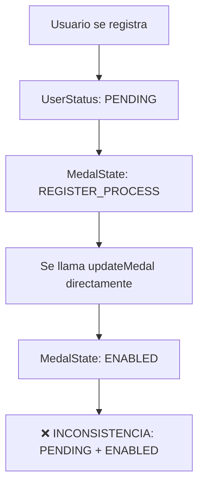
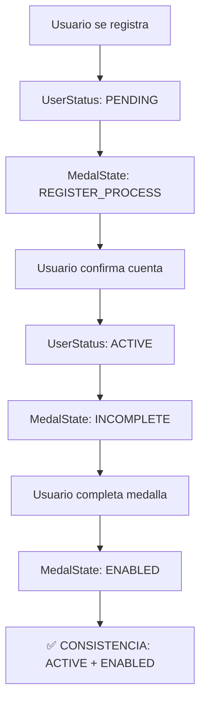

# 🐛 Bug Fix: Usuario PENDING con Medalla ENABLED

## 📋 Resumen

**Fecha**: 2025-01-27  
**Severidad**: CRÍTICA  
**Estado**: ✅ SOLUCIONADO  

## 🔍 Descripción del Problema

Se identificó un bug crítico en el flujo de registro que permitía que usuarios con estado `PENDING` tuvieran medallas (chapitas) marcadas como `ENABLED`. Esta inconsistencia violaba las reglas de negocio del sistema.

### Flujo Problemático



### Flujo Correcto



## 🛠️ Solución Implementada

### 1. Validación en PetsService.updateMedal()

**Archivo**: `backend-vlad/src/pets/pets.service.ts`

**Cambios realizados**:

```typescript
// ANTES (problemático)
async updateMedal(email: string, medalUpdate: UpdateMedalDto) {
    const result = await this.prisma.$transaction(async (tx) => {
        // Actualizar usuario (solo phoneNumber)
        const user = await tx.user.update({
            where: { email },
            data: { phonenumber: medalUpdate.phoneNumber }
        });
        
        // Actualizar medalla a ENABLED (sin verificar userStatus)
        const medal = await tx.medal.update({
            where: { medalString: medalUpdate.medalString },
            data: { status: MedalState.ENABLED }
        });
    });
}

// DESPUÉS (corregido)
async updateMedal(email: string, medalUpdate: UpdateMedalDto) {
    const result = await this.prisma.$transaction(async (tx) => {
        // 1. Verificar que el usuario existe y está ACTIVE
        const user = await tx.user.findUnique({
            where: { email },
            include: { medals: true }
        });
        if(!user) throw new NotFoundException('User not found');
        
        // 2. Validar que el usuario esté ACTIVE
        if(user.userStatus !== UserStatus.ACTIVE) {
            throw new BadRequestException('Usuario debe estar activo para habilitar la medalla');
        }

        // 3. Actualizar usuario
        const updatedUser = await tx.user.update({
            where: { email },
            data: { phonenumber: medalUpdate.phoneNumber }
        });

        // 4. Actualizar medalla a ENABLED (ahora es seguro)
        const medal = await tx.medal.update({
            where: { medalString: medalUpdate.medalString },
            data: { status: MedalState.ENABLED }
        });
    });
}
```

### 2. Script de Corrección de Datos Existentes

**Archivo**: `backend-vlad/scripts/fix-pending-users-with-enabled-medals.js`

Este script identifica y corrige usuarios existentes que puedan tener esta inconsistencia:

```bash
# Ejecutar el script
cd backend-vlad
node scripts/fix-pending-users-with-enabled-medals.js
```

### 3. Tests de Validación

**Archivo**: `backend-vlad/test/pets.service.spec.ts`

Se crearon tests para validar que:
- ✅ Usuarios PENDING no pueden habilitar medallas
- ✅ Usuarios ACTIVE pueden habilitar medallas
- ✅ Usuarios DISABLED no pueden habilitar medallas
- ✅ Se lanza excepción apropiada para cada caso

## 🧪 Cómo Probar la Solución

### 1. Test Manual

```bash
# 1. Crear un usuario PENDING
curl -X POST http://localhost:3333/qr-checking \
  -H "Content-Type: application/json" \
  -d '{
    "medalString": "TEST123",
    "ownerEmail": "test@example.com",
    "petName": "Test Pet",
    "password": "password123"
  }'

# 2. Intentar habilitar medalla (debería fallar)
curl -X PATCH http://localhost:3333/pets/update-medal \
  -H "Content-Type: application/json" \
  -d '{
    "medalString": "TEST123",
    "description": "Test description",
    "phoneNumber": "123456789"
  }'

# Respuesta esperada: 400 Bad Request
# "Usuario debe estar activo para habilitar la medalla"
```

### 2. Test Automatizado

```bash
cd backend-vlad
npm test -- pets.service.spec.ts
```

## 📊 Impacto de la Solución

### Antes del Fix
- ❌ Usuarios PENDING podían tener medallas ENABLED
- ❌ Inconsistencia en la base de datos
- ❌ Violación de reglas de negocio
- ❌ Posibles problemas en el frontend

### Después del Fix
- ✅ Solo usuarios ACTIVE pueden tener medallas ENABLED
- ✅ Consistencia garantizada en la base de datos
- ✅ Reglas de negocio respetadas
- ✅ Flujo de registro más robusto

## 🔄 Próximos Pasos

1. **Ejecutar script de corrección** en producción
2. **Monitorear logs** para detectar intentos de acceso no autorizados
3. **Revisar otros endpoints** que puedan tener validaciones similares
4. **Actualizar documentación** de la API

## 📝 Notas Técnicas

- La validación se hace dentro de la transacción para garantizar consistencia
- Se usa `BadRequestException` para indicar error de validación de negocio
- El script de corrección es idempotente (se puede ejecutar múltiples veces)
- Los tests cubren todos los casos edge

## 🏷️ Tags

`bug-fix` `critical` `data-consistency` `user-status` `medal-state` `validation`
