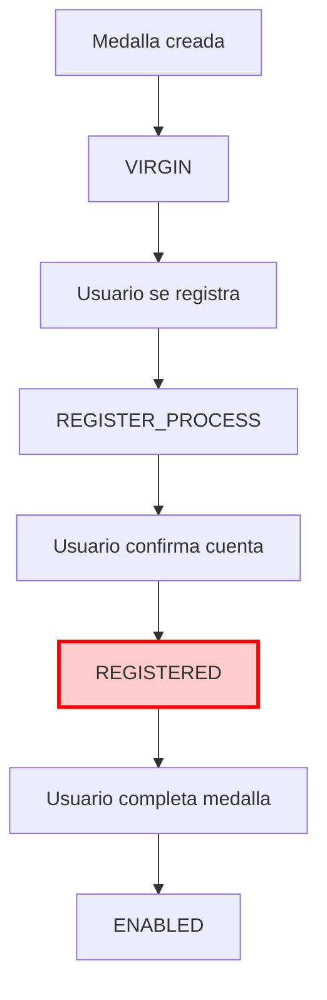

# 🔍 Análisis Completo del Sistema de Reseteo de Medallas

## 📋 Resumen

**Fecha**: 2025-01-27  
**Objetivo**: Análisis detallado del flujo de reseteo de medallas y su relación con los estados REGISTERED vs INCOMPLETE

## 🎯 Puntos de Entrada del Reseteo

### **1. Frontend - Administración de Medallas**
**Archivo**: `frontend/src/app/pages/medal-administration/medal-administration.component.ts`

```typescript
resetMedal() {
    const resetData = {
        medalString: this.medalString,
        userEmail: 'reset@peludosclick.com' // Email genérico
    };
    
    this.qrService.processMedalReset(resetData).subscribe({
        next: (res: any) => {
            this.success = res.message || 'Medalla reseteada correctamente.';
            // Navegar a mascota-checking después de 2 segundos
            setTimeout(() => {
                this.navigationService.navigate([ROUTES.MASCOTA_CHECKING], {
                    queryParams: { medalString: this.medalString }
                });
            }, 2000);
        }
    });
}
```

### **2. Frontend - Admin Reset**
**Archivo**: `frontend/src/app/pages/admin-reset/admin-reset.component.ts`

```typescript
processReset() {
    const resetData = {
        medalString: this.resetForm.value.medalString,
        userEmail: this.resetForm.value.userEmail
    };
    
    this.qrService.processMedalReset(resetData).subscribe({
        next: (res: any) => {
            this.success = res.message || 'Reset procesado correctamente.';
        }
    });
}
```

## 🔄 Flujo Completo del Reseteo

### **Paso 1: Validaciones Iniciales**
**Archivo**: `backend-vlad/src/qr-checking/qr-checking.service.ts:470-490`

```typescript
async processMedalReset(medalString: string, userEmail: string) {
    // 1. Verificar que la medalla existe
    const virginMedal = await this.prisma.virginMedal.findFirst({
        where: { medalString }
    });

    if (!virginMedal) {
        throw new NotFoundException('Medalla no encontrada');
    }

    // 2. Verificar que el estado permite reset
    const allowedStates = ['REGISTER_PROCESS', 'PENDING_CONFIRMATION', 'INCOMPLETE'];
    if (!allowedStates.includes(virginMedal.status)) {
        throw new BadRequestException('El estado actual de la medalla no permite reset');
    }
}
```

**🚨 PROBLEMA IDENTIFICADO**: 
- **REGISTERED NO está en `allowedStates`**
- Esto significa que medallas en estado REGISTERED **NO pueden ser reseteadas**
- Es un bug crítico que atrapa medallas en estado REGISTERED

### **Paso 2: Transacción de Reseteo**
**Archivo**: `backend-vlad/src/qr-checking/qr-checking.service.ts:498-533`

```typescript
const result = await this.prisma.$transaction(async (prisma) => {
    // 1. Cambiar virgin medal a VIRGIN
    await prisma.virginMedal.update({
        where: { medalString },
        data: { 
            status: 'VIRGIN'
            // Mantener el registerHash original, no cambiarlo a 'genesis'
        }
    });

    // 2. Si existe medalla registrada, verificar si eliminar usuario
    if (registeredMedal) {
        // 3. Verificar medallas del usuario ANTES de eliminar
        const userMedals = await prisma.medal.findMany({
            where: { ownerId: registeredMedal.ownerId }
        });

        // 4. Eliminar la medalla
        await prisma.medal.delete({
            where: { medalString }
        });

        // 5. Si era la única medalla, eliminar el usuario
        if (userMedals.length === 1) {
            await prisma.user.delete({
                where: { id: registeredMedal.ownerId }
            });
        }
    }

    // 6. Limpiar cache
    this.medalCache.delete(medalString);
    this.petCache.delete(medalString);

    return { success: true };
});
```

## 🔍 Análisis de Estados y Flujos

### **Estados Permitidos para Reset**
```typescript
const allowedStates = ['REGISTER_PROCESS', 'PENDING_CONFIRMATION', 'INCOMPLETE'];
```

**❌ REGISTERED NO está incluido** - Esto es un bug crítico

### **Flujo de Estados Durante el Registro**



### **Estados que SÍ pueden ser Reseteados**
- ✅ **REGISTER_PROCESS**: Usuario se registró pero no confirmó cuenta
- ✅ **PENDING_CONFIRMATION**: Medalla pendiente de confirmación
- ✅ **INCOMPLETE**: Medalla incompleta (usuario confirmó cuenta pero no completó medalla)

### **Estados que NO pueden ser Reseteados**
- ❌ **REGISTERED**: Medalla en estado intermedio confuso
- ❌ **ENABLED**: Medalla completamente funcional
- ❌ **DISABLED**: Medalla deshabilitada
- ❌ **DEAD**: Medalla eliminada
- ❌ **VIRGIN**: Medalla recién creada

## 🚨 Bug Crítico Identificado

### **El Problema**

1. **Medallas quedan atrapadas en estado REGISTERED**
2. **No pueden ser reseteadas** porque REGISTERED no está en `allowedStates`
3. **Estado REGISTERED es confuso** - no está claro qué funcionalidad tiene
4. **Inconsistencia conceptual** entre REGISTERED e INCOMPLETE

### **Escenario Problemático**

```
1. Usuario se registra → virgin_medal: REGISTER_PROCESS
2. Usuario confirma cuenta → virgin_medal: REGISTERED
3. Usuario no completa medalla
4. Admin intenta resetear → ❌ ERROR: "El estado actual de la medalla no permite reset"
5. Medalla queda atrapada en REGISTERED
```

## 🔧 Soluciones Propuestas

### **Solución 1: Incluir REGISTERED en allowedStates**
```typescript
const allowedStates = ['REGISTER_PROCESS', 'PENDING_CONFIRMATION', 'INCOMPLETE', 'REGISTERED'];
```

**Problema**: No resuelve la confusión conceptual entre REGISTERED e INCOMPLETE

### **Solución 2: Eliminar REGISTERED y usar INCOMPLETE**
```typescript
// En auth.service.ts línea 122
// ANTES:
status: MedalState.REGISTERED

// DESPUÉS:
status: MedalState.INCOMPLETE
```

**Ventajas**:
- ✅ Elimina confusión conceptual
- ✅ REGISTERED ya estaría incluido en allowedStates (como INCOMPLETE)
- ✅ Flujo más claro y consistente

### **Solución 3: Clarificar el propósito de REGISTERED**
- Documentar exactamente qué significa REGISTERED
- Definir cuándo usar REGISTERED vs INCOMPLETE
- Incluir REGISTERED en allowedStates

## 📊 Impacto del Bug

### **Problemas Identificados**

1. **Medallas atrapadas**: No se pueden resetear medallas en estado REGISTERED
2. **Confusión conceptual**: REGISTERED vs INCOMPLETE
3. **Inconsistencia**: Dos estados para el mismo concepto
4. **Mantenimiento**: Código más complejo de lo necesario

### **Riesgos**

- Medallas inutilizables en estado REGISTERED
- Usuarios no pueden completar el proceso
- Administradores no pueden resetear medallas problemáticas
- Lógica de negocio confusa

## 🎯 Recomendación Final

**Eliminar el estado REGISTERED** y usar INCOMPLETE en su lugar:

### **Cambios Necesarios**

1. **auth.service.ts línea 122**:
```typescript
// ANTES
status: MedalState.REGISTERED

// DESPUÉS
status: MedalState.INCOMPLETE
```

2. **Actualizar documentación** del flujo de estados

3. **Migrar datos existentes** de REGISTERED a INCOMPLETE

### **Beneficios**

- ✅ Elimina confusión conceptual
- ✅ Medallas REGISTERED pueden ser reseteadas (como INCOMPLETE)
- ✅ Flujo más claro y consistente
- ✅ Menos estados que mantener

## 🏷️ Tags

`bug-analysis` `medal-reset` `virgin-medals` `state-inconsistency` `critical` `trapped-medals`
