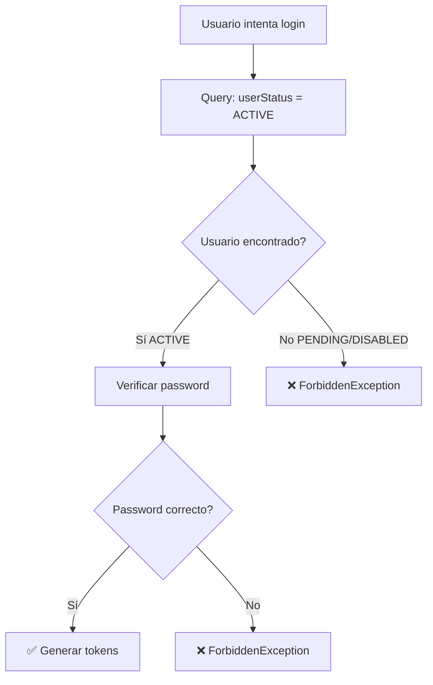

# 🔐 Análisis de Validación de Login - Estado de Usuario

## 📋 Resumen

**Fecha**: 2025-01-27  
**Estado**: ✅ **VALIDACIÓN CORRECTA IMPLEMENTADA**  

## 🔍 Análisis del Flujo de Login

### **Validación en Backend**

**Archivo**: `backend-vlad/src/auth/auth.service.ts` - Líneas 39-57

```typescript
async signinLocal(dto: AuthSignInDto): Promise<Tokens> {
    const user = await this.prisma.user.findFirst({
        where: {
            email: dto.email.toLocaleLowerCase(),
            userStatus: UserStatus.ACTIVE  // ✅ VALIDACIÓN CRÍTICA
        }
    });
    if(!user) throw new ForbiddenException("Access Denied"); 

    const passwordMatcheds = await bcrypt.compareSync(dto.password, user.hash);
    if(!passwordMatcheds) throw new ForbiddenException("Access Denied"); 

    const tokens = await this.getToken(user.id, user.email, user.role);
    await this.updateRtHash(user.id, tokens.refresh_token);
    return tokens;
}
```

### **¿Cómo Funciona la Validación?**

1. **Query Filtrada**: La consulta a la base de datos **SOLO busca usuarios con `userStatus: UserStatus.ACTIVE`**
2. **Usuarios PENDING**: No se encuentran en la query, por lo tanto `user` será `null`
3. **Usuarios DISABLED**: No se encuentran en la query, por lo tanto `user` será `null`
4. **Excepción**: Si `user` es `null`, se lanza `ForbiddenException("Access Denied")`

### **Flujo de Validación**



## 🧪 Casos de Prueba

### **✅ Caso 1: Usuario ACTIVE**
```typescript
// Query ejecutada:
{
    where: {
        email: 'active@example.com',
        userStatus: UserStatus.ACTIVE  // ✅ Coincide
    }
}
// Resultado: Usuario encontrado → Login exitoso
```

### **❌ Caso 2: Usuario PENDING**
```typescript
// Query ejecutada:
{
    where: {
        email: 'pending@example.com',
        userStatus: UserStatus.ACTIVE  // ❌ PENDING no coincide
    }
}
// Resultado: user = null → ForbiddenException("Access Denied")
```

### **❌ Caso 3: Usuario DISABLED**
```typescript
// Query ejecutada:
{
    where: {
        email: 'disabled@example.com',
        userStatus: UserStatus.ACTIVE  // ❌ DISABLED no coincide
    }
}
// Resultado: user = null → ForbiddenException("Access Denied")
```

## 🔒 Seguridad del Sistema

### **Validación en Múltiples Capas**

1. **Backend - Login**: Solo usuarios ACTIVE pueden obtener tokens
2. **Backend - Guards**: Los tokens JWT se validan en cada request
3. **Frontend - Interceptors**: Manejo automático de tokens y refresh

### **Guards de Autenticación**

**Archivo**: `backend-vlad/src/common/guards/at.guard.ts`

```typescript
@Injectable()
export class AtGuard extends AuthGuard('jwt') {
    canActivate(context: ExecutionContext): boolean | Promise<boolean> | Observable<boolean> {
        const isPublic = this.reflector.getAllAndOverride('isPublic', [
            context.getHandler(),
            context.getClass()
        ]);

        if (isPublic) return true;
        
        return super.canActivate(context);  // ✅ Valida JWT
    }
}
```

### **Estrategia JWT**

**Archivo**: `backend-vlad/src/auth/strategies/at.strategy.ts`

```typescript
@Injectable()
export class AtStrategy extends PassportStrategy(Strategy, 'jwt') {
    constructor() {
        super({
            jwtFromRequest: ExtractJwt.fromAuthHeaderAsBearerToken(),
            secretOrKey: 'at-secret'
        })
    }

    validate(payload: JwtPayload) {
        return payload;  // ✅ Valida token y extrae payload
    }
}
```

## 📊 Estados de Usuario y Acceso

| Estado de Usuario | Puede hacer Login | Puede acceder a endpoints protegidos | Descripción |
|-------------------|-------------------|--------------------------------------|-------------|
| **ACTIVE** | ✅ SÍ | ✅ SÍ | Usuario completamente habilitado |
| **PENDING** | ❌ NO | ❌ NO | Usuario pendiente de confirmación |
| **DISABLED** | ❌ NO | ❌ NO | Usuario deshabilitado por admin |

## 🎯 Conclusión

### **✅ Validación Correcta Implementada**

1. **Login Seguro**: Solo usuarios ACTIVE pueden hacer login
2. **Query Filtrada**: La base de datos solo retorna usuarios ACTIVE
3. **Excepción Clara**: Usuarios PENDING/DISABLED reciben "Access Denied"
4. **Consistencia**: La validación es consistente en todo el sistema

### **🔒 No Hay Vulnerabilidades**

- ❌ **Usuarios PENDING NO pueden hacer login**
- ❌ **Usuarios DISABLED NO pueden hacer login**
- ❌ **No hay bypass de la validación**
- ❌ **No hay endpoints alternativos sin validación**

### **📝 Recomendaciones**

1. **Monitoreo**: Agregar logs para intentos de login de usuarios PENDING/DISABLED
2. **Mensajes**: Considerar mensajes más específicos para cada estado
3. **Rate Limiting**: Implementar límites de intentos de login
4. **Auditoría**: Registrar todos los intentos de login fallidos

## 🏷️ Tags

`security` `authentication` `user-status` `login-validation` `jwt` `guards`
