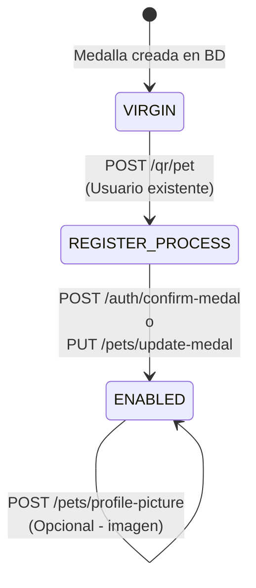
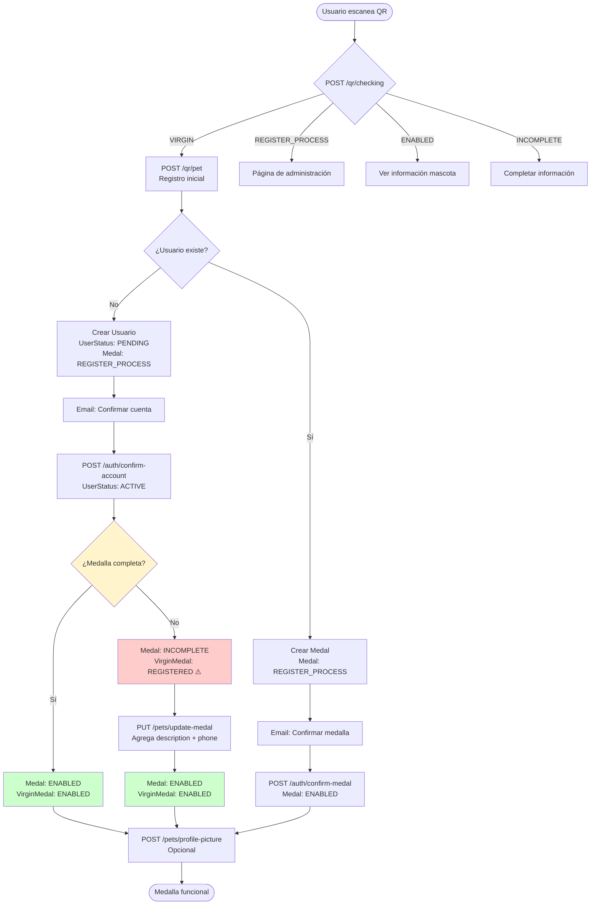

# 🔍 Análisis Completo del Flujo de Carga de Medallas

## 📋 Objetivo

Documentar el flujo completo de carga de medallas desde el primer escaneo del QR hasta que la mascota queda totalmente cargada, activa y funcional. Identificar problemas, estados confusos y oportunidades de simplificación.

---

## 📊 Diagrama del Flujo Actual

### Flujo Completo - Usuario Nuevo

```mermaid
stateDiagram-v2
    [*] --> VIRGIN: Medalla creada en BD
    VIRGIN --> REGISTER_PROCESS: POST /qr/pet<br/>(Usuario nuevo)
    REGISTER_PROCESS --> PENDING: Usuario creado<br/>UserStatus: PENDING
    PENDING --> INCOMPLETE: POST /auth/confirm-account<br/>UserStatus: ACTIVE<br/>Medal: INCOMPLETE<br/>VirginMedal: REGISTERED ⚠️
    INCOMPLETE --> ENABLED: PUT /pets/update-medal<br/>Agrega description + phone
    ENABLED --> ENABLED: POST /pets/profile-picture<br/>(Opcional - imagen)
    
    note right of REGISTERED
        ⚠️ PROBLEMA: Estado confuso
        Solo usado en VirginMedal
        Inconsistente con Medal.status
    end note
```

### Flujo Completo - Usuario Existente



### Flujo Unificado Visual



---

## 🔄 Estados y Transiciones

### Tabla de Estados Actuales

| Estado | Tabla | Cuándo se usa | Problema |
|--------|-------|---------------|----------|
| `VIRGIN` | `virgin_medals` | Medalla recién creada, nunca registrada | ✅ OK |
| `REGISTER_PROCESS` | Ambas | Usuario inició registro pero no confirmó | ✅ OK |
| `INCOMPLETE` | `medals` | Cuenta confirmada pero falta información | ✅ OK |
| `REGISTERED` | `virgin_medals` | Cuenta confirmada pero medalla incompleta | ❌ Confuso, inconsistente |
| `ENABLED` | Ambas | Medalla completamente funcional | ✅ OK |
| `DISABLED` | Ambas | Deshabilitada manualmente | ✅ OK |
| `DEAD` | Ambas | Eliminada | ✅ OK |
| `PENDING_CONFIRMATION` | Ninguna | No se usa | ⚠️ Innecesario |

### Matriz de Transiciones Válidas (Actual)

| Desde | Hacia | Endpoint/Método | Validación |
|-------|-------|-----------------|------------|
| `VIRGIN` | `REGISTER_PROCESS` | `POST /qr/pet` | ✅ Verifica que es VIRGIN |
| `REGISTER_PROCESS` | `INCOMPLETE` | `POST /auth/confirm-account` | ⚠️ No valida estado previo |
| `REGISTER_PROCESS` | `ENABLED` | `POST /auth/confirm-medal` | ⚠️ No valida estado previo |
| `REGISTER_PROCESS` | `ENABLED` | `PUT /pets/update-medal` | ⚠️ No valida estado previo |
| `INCOMPLETE` | `ENABLED` | `PUT /pets/update-medal` | ✅ Valida UserStatus ACTIVE |
| `*` | `ENABLED` | `PUT /pets/update-medal` | ❌ Permite cualquier estado |

**Problema**: No hay validación de transiciones válidas. Cualquier estado puede cambiar a `ENABLED` desde `updateMedal()`.

---

## 📝 Flujo Detallado Paso a Paso

### Paso 1: Primer Escaneo del QR

**Endpoint**: `POST /qr/checking`  
**Método**: `QrService.QRCheking()`  
**Archivo**: `backend-vlad/src/qr-checking/qr-checking.service.ts:31-76`

**Proceso**:
1. Verifica si la medalla existe en `virgin_medals` por `medalString`
2. Retorna estado actual, `medalString` y `registerHash`
3. Usa cache en memoria (TTL: 5 minutos)

**Estados posibles y acciones**:
- `VIRGIN` → Redirige a registro (`/agregar-mascota/:medalString`)
- `REGISTER_PROCESS` → Muestra mensaje "en proceso de registro"
- `ENABLED` → Redirige a información de mascota
- `INCOMPLETE` → Redirige a completar información
- Otros estados → Redirige a administración de medalla

---

### Paso 2: Registro Inicial de Medalla

**Endpoint**: `POST /qr/pet`  
**Método**: `QrService.postMedal()`  
**Archivo**: `backend-vlad/src/qr-checking/qr-checking.service.ts:78-211`

**Validaciones**:
- Verifica que `virgin_medal` existe
- Verifica que estado es `VIRGIN` (si no, lanza error)

**Dos caminos posibles**:

#### Camino A: Usuario Nuevo
**Método**: `processMedalForNewUser()` (líneas 156-211)

**Transacción**:
1. Crea `User` con:
   - `email` (lowercase)
   - `hash` (password hasheado)
   - `userStatus: PENDING`
   - `role: VISITOR`
   - `hashToRegister` (hash único de 36 caracteres)
2. Crea `Medal` con:
   - `status: REGISTER_PROCESS`
   - `medalString` (de virgin_medal)
   - `registerHash` (de virgin_medal)
   - `petName` (del formulario)
   - Relación con usuario creado
3. Actualiza `VirginMedal`:
   - `status: REGISTER_PROCESS`

**Después de transacción** (asíncrono):
- Envía email de confirmación de cuenta
- URL: `/confirmar-cuenta?hashEmail={email}&hashToRegister={hash}&medalString={medalString}`

**Resultado**: `{ text: 'Le hemos enviado un email...', code: 'usercreated' }`

#### Camino B: Usuario Existente
**Método**: `processMedalForExistingUser()` (líneas 108-154)

**Transacción**:
1. Crea `Medal` con:
   - `status: REGISTER_PROCESS`
   - `medalString` (de virgin_medal)
   - `registerHash` (de virgin_medal)
   - `petName` (del formulario)
   - Relación con usuario existente
2. Actualiza `VirginMedal`:
   - `status: REGISTER_PROCESS`

**Después de transacción** (asíncrono):
- Envía email de confirmación de medalla
- URL: `/confirmar-medalla?email={email}&medalString={medalString}`

**Resultado**: `{ text: 'Le hemos enviado un email...', code: 'medalcreated' }`

**Estado después del Paso 2**:
- `User.userStatus`: `PENDING` (nuevo) o `ACTIVE` (existente)
- `Medal.status`: `REGISTER_PROCESS`
- `VirginMedal.status`: `REGISTER_PROCESS`

---

### Paso 3: Confirmación de Cuenta (Solo para usuarios nuevos)

**Endpoint**: `POST /auth/confirm-account`  
**Método**: `AuthService.confirmAccount()`  
**Archivo**: `backend-vlad/src/auth/auth.service.ts:81-143`

**Validaciones**:
- Usuario existe
- `hashToRegister` coincide
- Medalla existe

**Transacción**:
1. Actualiza `User`:
   - `userStatus: PENDING → ACTIVE`
2. Verifica si medalla está completa (`isMedalComplete()`):
   - Requiere: `petName`, `description`, `medalString`, `registerHash`
   - Ambos campos de texto no vacíos
   - ⚠️ **PROBLEMA**: `description` nunca existe en este punto, siempre será `INCOMPLETE`
3. Actualiza `Medal`:
   - Si completa: `status: REGISTER_PROCESS → ENABLED`
   - Si incompleta: `status: REGISTER_PROCESS → INCOMPLETE`
4. Actualiza `VirginMedal`:
   - Si completa: `status: REGISTER_PROCESS → ENABLED`
   - Si incompleta: `status: REGISTER_PROCESS → REGISTERED` ⚠️ **PROBLEMA**

**Estado después del Paso 3**:
- `User.userStatus`: `ACTIVE`
- `Medal.status`: `ENABLED` o `INCOMPLETE`
- `VirginMedal.status`: `ENABLED` o `REGISTERED` ⚠️

---

### Paso 4A: Completar Información de Medalla (Si quedó INCOMPLETE)

**Endpoint**: `PUT /pets/update-medal`  
**Método**: `PetsService.updateMedal()`  
**Archivo**: `backend-vlad/src/pets/pets.service.ts:182-236`

**Validaciones**:
- Usuario existe y está `ACTIVE` ✅
- Medalla existe
- ⚠️ **PROBLEMA**: No valida que el estado previo sea `INCOMPLETE` o `REGISTER_PROCESS`

**Transacción**:
1. Actualiza `User`:
   - `phonenumber` (del formulario)
2. Actualiza `Medal`:
   - `description` (del formulario)
   - `status: INCOMPLETE → ENABLED` (o cualquier estado → ENABLED)
3. Actualiza `VirginMedal`:
   - `status: REGISTERED → ENABLED` o `INCOMPLETE → ENABLED`

**Después de transacción** (asíncrono):
- Envía email de notificación a `info@peludosclick.com`

**Estado después del Paso 4A**:
- `Medal.status`: `ENABLED`
- `VirginMedal.status`: `ENABLED`

---

### Paso 4B: Confirmación de Medalla (Alternativa para usuarios existentes)

**Endpoint**: `POST /auth/confirm-medal`  
**Método**: `AuthService.confirmMedal()`  
**Archivo**: `backend-vlad/src/auth/auth.service.ts:145-172`

**Transacción**:
1. Actualiza `Medal`:
   - `status: REGISTER_PROCESS → ENABLED`
2. Actualiza `VirginMedal`:
   - `status: REGISTER_PROCESS → ENABLED`

**Estado después del Paso 4B**:
- `Medal.status`: `ENABLED`
- `VirginMedal.status`: `ENABLED`

---

### Paso 5: Carga de Imagen (Opcional)

**Endpoint**: `POST /pets/profile-picture`  
**Método**: `PetsService.loadImage()`  
**Archivo**: `backend-vlad/src/pets/pets.service.ts:141-180`

**Proceso**:
1. Actualiza `Medal.image` con nombre del archivo
2. Elimina imagen anterior (si existe)
3. Crea versión para redes sociales (redimensionada)

**Nota**: No cambia estados, solo agrega imagen

---

## 🚨 Problemas Identificados

### 1. Estado `REGISTERED` Confuso

**Ubicación**: `auth.service.ts:134`

**Problema**:
- `REGISTERED` solo se usa en `virgin_medals` cuando la cuenta se confirma pero la medalla está incompleta
- No tiene propósito funcional claro
- Es inconsistente: `Medal.status = INCOMPLETE` pero `VirginMedal.status = REGISTERED`
- Confunde con el concepto de "registrado" vs "habilitado"
- No está incluido en `allowedStates` para reset, causando medallas atrapadas

**Impacto**:
- Dificulta debugging
- Lógica de negocio confusa
- Posibles bugs en frontend al manejar estados
- Medallas no se pueden resetear si quedan en `REGISTERED`

**Código problemático**:
```typescript
// auth.service.ts:134
await tx.virginMedal.update({
    where: { medalString: dto.medalString },
    data: { status: isComplete ? MedalState.ENABLED : MedalState.REGISTERED }  // ⚠️
});
```

---

### 2. Estado `PENDING_CONFIRMATION` No Usado

**Problema**:
- Existe en el enum pero nunca se usa en el código
- Podría ser útil para diferenciar estados

**Solución propuesta**:
- Eliminar del enum si no se usará
- O implementarlo para medallas que esperan confirmación de email

---

### 3. Lógica de Completitud en `confirmAccount()`

**Problema**:
- La función `isMedalComplete()` verifica si `description` existe
- Pero en el Paso 2, la medalla se crea SIN `description`
- Entonces siempre será `INCOMPLETE` después de confirmar cuenta
- Esto hace que el flujo siempre requiera el Paso 4A

**Código problemático** (`auth.service.ts:318-327`):
```typescript
private isMedalComplete(medal: any): boolean {
    return !!(
        medal.petName && 
        medal.description &&  // ⚠️ Nunca existe en este punto
        medal.medalString && 
        medal.registerHash &&
        medal.petName.trim() !== '' &&
        medal.description.trim() !== ''
    );
}
```

**Impacto**:
- Flujo siempre requiere dos pasos (confirmar cuenta + completar info)
- No hay camino directo a `ENABLED` desde confirmación de cuenta
- Lógica innecesariamente restrictiva

---

### 4. Inconsistencia entre `Medal` y `VirginMedal`

**Problema**:
- Después de `confirmAccount()`:
  - `Medal.status = INCOMPLETE`
  - `VirginMedal.status = REGISTERED`
- Estados diferentes para la misma medalla en dos tablas

**Impacto**:
- Dificulta consultas y debugging
- Lógica de negocio fragmentada
- Confusión sobre qué estado es el "correcto"

---

### 5. Flujo Complejo con Múltiples Caminos

**Problema**:
- Usuario nuevo: Paso 2 → Paso 3 → Paso 4A → Paso 5
- Usuario existente: Paso 2 → Paso 4B → Paso 5
- Dos endpoints diferentes para confirmar (`confirm-account` vs `confirm-medal`)
- Dificulta entender el flujo completo

**Impacto**:
- Onboarding confuso para nuevos desarrolladores
- Más puntos de fallo
- Difícil de testear
- Mantenimiento complejo

---

### 6. Falta de Validación de Estados en Transiciones

**Problema**:
- No se valida que las transiciones de estado sean válidas
- Ejemplo: `updateMedal()` puede cambiar de cualquier estado a `ENABLED` sin validar
- `confirmMedal()` no valida que el estado previo sea `REGISTER_PROCESS`

**Impacto**:
- Posibles estados inválidos en la base de datos
- Bugs difíciles de rastrear
- Inconsistencias de datos

**Código problemático**:
```typescript
// pets.service.ts:205-211
const medal = await tx.medal.update({
    where: { medalString: medalUpdate.medalString },
    data: {
        description: medalUpdate.description,
        status: MedalState.ENABLED  // ⚠️ Puede venir de cualquier estado
    }
});
```

---

## 📊 Resumen de Problemas

| # | Problema | Severidad | Impacto | Archivo |
|---|----------|-----------|---------|---------|
| 1 | Estado `REGISTERED` confuso | 🔴 CRÍTICO | Alto | `auth.service.ts:134` |
| 2 | `PENDING_CONFIRMATION` no usado | 🟡 MEDIO | Bajo | `schema.prisma` |
| 3 | Lógica de completitud incorrecta | 🔴 CRÍTICO | Alto | `auth.service.ts:318` |
| 4 | Inconsistencia entre tablas | 🔴 CRÍTICO | Alto | `auth.service.ts:134` |
| 5 | Flujo complejo múltiples caminos | 🟡 MEDIO | Medio | Varios archivos |
| 6 | Sin validación de transiciones | 🔴 CRÍTICO | Alto | `pets.service.ts:205` |

---

## 📁 Archivos Involucrados

### Backend
- `backend-vlad/src/qr-checking/qr-checking.service.ts` - Lógica de registro
- `backend-vlad/src/qr-checking/qr-checking.controller.ts` - Endpoints QR
- `backend-vlad/src/auth/auth.service.ts` - Confirmaciones
- `backend-vlad/src/auth/auth.controller.ts` - Endpoints auth
- `backend-vlad/src/pets/pets.service.ts` - Actualización de medallas
- `backend-vlad/src/pets/pets.controller.ts` - Endpoints pets
- `backend-vlad/prisma/schema.prisma` - Definición de estados

### Frontend
- `frontend/src/app/pages/qr-checking/qr-checking.component.ts` - Manejo de estados
- `frontend/src/app/pages/add-pet/add-pet.component.ts` - Registro inicial
- `frontend/src/app/pages/confirm-account/confirm-account.component.ts` - Confirmación
- `frontend/src/app/pages/confirm-medal/confirm-medal.component.ts` - Confirmación medalla
- `frontend/src/app/pages/medal-administration/medal-administration.component.ts` - Administración
- `frontend/src/app/services/qr-checking.service.ts` - Servicio QR

### Documentación
- `backend-vlad/MEDAL_STATES_ANALYSIS.md` - Análisis previo
- `backend-vlad/FLOWS_ANALYSIS.md` - Análisis de flujos
- `backend-vlad/COMPLETE_MEDAL_RESET_ANALYSIS.md` - Análisis de reset

---

## ✅ Conclusión

El flujo actual tiene varios problemas críticos que dificultan el mantenimiento y pueden causar bugs:

1. **Estados confusos**: `REGISTERED` no tiene propósito claro
2. **Inconsistencias**: Estados diferentes entre `Medal` y `VirginMedal`
3. **Falta de validación**: Transiciones de estado no validadas
4. **Lógica incorrecta**: `isMedalComplete()` siempre retorna `false` en `confirmAccount()`
5. **Complejidad innecesaria**: Múltiples caminos para el mismo resultado

**Próximos pasos**: Ver documento `MEDAL_FLOW_SIMPLIFICATION_PROPOSAL.md` para propuestas de simplificación.


