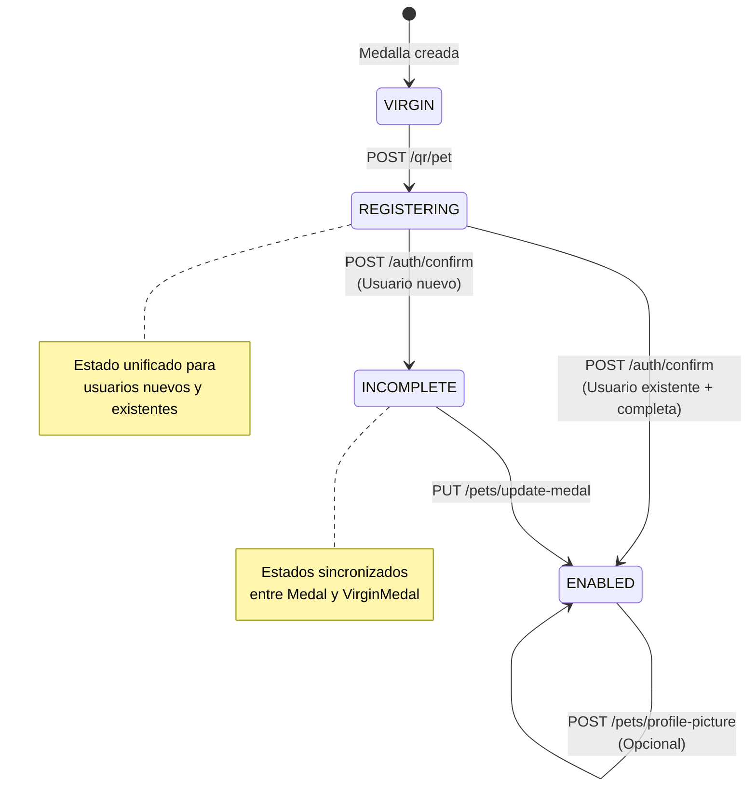

# 🔧 Propuestas de Simplificación del Flujo de Medallas

## 📋 Objetivo

Proponer simplificaciones específicas para el flujo de carga de medallas, reduciendo complejidad, eliminando inconsistencias y mejorando la mantenibilidad.

---

## 🎯 Principios de Simplificación

1. **Estados claros y unívocos**: Cada estado debe tener un propósito único y claro
2. **Consistencia entre tablas**: `Medal` y `VirginMedal` deben mantener estados sincronizados
3. **Validación de transiciones**: Solo permitir transiciones válidas de estado
4. **Flujo lineal**: Reducir caminos alternativos donde sea posible
5. **Lógica simple**: Eliminar verificaciones innecesarias

---

## 🔄 Propuesta 1: Simplificar Estados

### Estados Actuales (8 estados)
```typescript
enum MedalState {
  VIRGIN                    // ✅ OK
  ENABLED                   // ✅ OK
  DISABLED                  // ✅ OK
  DEAD                      // ✅ OK
  REGISTER_PROCESS          // ⚠️ Renombrar
  PENDING_CONFIRMATION      // ❌ Eliminar (no usado)
  INCOMPLETE               // ✅ OK
  REGISTERED               // ❌ Eliminar (confuso)
}
```

### Estados Propuestos (6 estados)
```typescript
enum MedalState {
  VIRGIN              // Medalla nueva, nunca registrada
  REGISTERING         // En proceso de registro (renombrado de REGISTER_PROCESS)
  INCOMPLETE          // Registro incompleto (falta información)
  ENABLED             // Completamente funcional
  DISABLED            // Deshabilitada manualmente
  DEAD                // Eliminada
}
```

### Cambios
- ✅ Eliminar `REGISTERED` → Usar `INCOMPLETE` en su lugar
- ✅ Eliminar `PENDING_CONFIRMATION` → No se usa
- ✅ Renombrar `REGISTER_PROCESS` → `REGISTERING` (más claro)

### Beneficios
- Menos estados = menos confusión
- Cada estado tiene propósito único
- Más fácil de entender y mantener

---

## 🔄 Propuesta 2: Unificar Estados entre Tablas

### Problema Actual
```typescript
// Después de confirmAccount() si incompleta:
Medal.status = INCOMPLETE
VirginMedal.status = REGISTERED  // ⚠️ Inconsistente
```

### Solución Propuesta
```typescript
// Después de confirmAccount() si incompleta:
Medal.status = INCOMPLETE
VirginMedal.status = INCOMPLETE  // ✅ Consistente
```

### Cambios en Código

**Archivo**: `backend-vlad/src/auth/auth.service.ts:134`

```typescript
// ANTES
await tx.virginMedal.update({
    where: { medalString: dto.medalString },
    data: {
        status: isComplete ? MedalState.ENABLED : MedalState.REGISTERED  // ⚠️
    }
});

// DESPUÉS
await tx.virginMedal.update({
    where: { medalString: dto.medalString },
    data: {
        status: isComplete ? MedalState.ENABLED : MedalState.INCOMPLETE  // ✅
    }
});
```

### Beneficios
- Estados sincronizados entre tablas
- Más fácil de consultar y debuggear
- Lógica consistente

---

## 🔄 Propuesta 3: Corregir Lógica de Completitud

### Problema Actual
```typescript
// auth.service.ts:318-327
private isMedalComplete(medal: any): boolean {
    return !!(
        medal.petName && 
        medal.description &&  // ⚠️ Nunca existe en este punto
        medal.medalString && 
        medal.registerHash &&
        medal.petName.trim() !== '' &&
        medal.description.trim() !== ''
    );
}
```

**Resultado**: Siempre retorna `false`, siempre va a `INCOMPLETE`

### Solución Propuesta A: Hacer `description` opcional para completitud

```typescript
private isMedalComplete(medal: any): boolean {
    // Solo verificar datos esenciales
    return !!(
        medal.petName && 
        medal.medalString && 
        medal.registerHash &&
        medal.petName.trim() !== ''
    );
}
```

**Beneficio**: Permite camino directo a `ENABLED` si solo tiene datos esenciales

### Solución Propuesta B: Mantener lógica pero documentar intención

```typescript
/**
 * Verifica si una medalla tiene todos los datos necesarios para estar completamente funcional.
 * NOTA: description es requerido para considerar la medalla completa.
 * Esto significa que después de confirmAccount(), la medalla siempre será INCOMPLETE
 * hasta que se complete con updateMedal().
 */
private isMedalComplete(medal: any): boolean {
    return !!(
        medal.petName && 
        medal.description &&  // Requerido para completitud
        medal.medalString && 
        medal.registerHash &&
        medal.petName.trim() !== '' &&
        medal.description.trim() !== ''
    );
}
```

**Recomendación**: Usar Solución A para simplificar el flujo

---

## 🔄 Propuesta 4: Validar Transiciones de Estado

### Problema Actual
No se valida que las transiciones sean válidas. Cualquier estado puede cambiar a `ENABLED`.

### Solución: Máquina de Estados

**Archivo**: `backend-vlad/src/common/medal-state-machine.ts` (nuevo)

```typescript
import { MedalState } from '@prisma/client';
import { BadRequestException } from '@nestjs/common';

export class MedalStateMachine {
    // Transiciones válidas
    private static readonly VALID_TRANSITIONS: Record<MedalState, MedalState[]> = {
        [MedalState.VIRGIN]: [MedalState.REGISTERING],
        [MedalState.REGISTERING]: [MedalState.INCOMPLETE, MedalState.ENABLED],
        [MedalState.INCOMPLETE]: [MedalState.ENABLED],
        [MedalState.ENABLED]: [MedalState.DISABLED, MedalState.DEAD],
        [MedalState.DISABLED]: [MedalState.ENABLED, MedalState.DEAD],
        [MedalState.DEAD]: [], // Estado final
    };

    /**
     * Valida si una transición de estado es válida
     */
    static validateTransition(from: MedalState, to: MedalState): void {
        const validTargets = this.VALID_TRANSITIONS[from];
        
        if (!validTargets || !validTargets.includes(to)) {
            throw new BadRequestException(
                `Transición inválida: ${from} → ${to}. ` +
                `Transiciones válidas desde ${from}: ${validTargets.join(', ')}`
            );
        }
    }

    /**
     * Obtiene los estados válidos desde un estado dado
     */
    static getValidTransitions(from: MedalState): MedalState[] {
        return this.VALID_TRANSITIONS[from] || [];
    }
}
```

### Uso en Servicios

**Archivo**: `backend-vlad/src/pets/pets.service.ts:205`

```typescript
// ANTES
const medal = await tx.medal.update({
    where: { medalString: medalUpdate.medalString },
    data: {
        description: medalUpdate.description,
        status: MedalState.ENABLED  // ⚠️ Sin validación
    }
});

// DESPUÉS
// Obtener estado actual
const currentMedal = await tx.medal.findUnique({
    where: { medalString: medalUpdate.medalString }
});

if (!currentMedal) throw new NotFoundException('Medal not found');

// Validar transición
MedalStateMachine.validateTransition(currentMedal.status, MedalState.ENABLED);

// Actualizar
const medal = await tx.medal.update({
    where: { medalString: medalUpdate.medalString },
    data: {
        description: medalUpdate.description,
        status: MedalState.ENABLED
    }
});
```

### Beneficios
- Previene estados inválidos
- Documenta transiciones válidas
- Facilita debugging
- Mejora la integridad de datos

---

## 🔄 Propuesta 5: Unificar Flujos de Confirmación

### Problema Actual
- Dos endpoints diferentes: `confirm-account` y `confirm-medal`
- Lógica duplicada
- Difícil de entender

### Solución: Unificar en un solo endpoint

**Nuevo endpoint**: `POST /auth/confirm`

```typescript
// auth.controller.ts
@Public()
@Post('confirm')
@HttpCode(HttpStatus.OK)
confirm(@Body() dto: ConfirmDto): any {
    return this.authService.confirm(dto);
}
```

**Nuevo método unificado**: `auth.service.ts`

```typescript
async confirm(dto: ConfirmDto) {
    return await this.prisma.$transaction(async (tx) => {
        // 1. Verificar usuario
        const user = await tx.user.findFirst({
            where: { email: dto.email.toLowerCase() },
            include: { medals: true }
        });

        if (!user) throw new NotFoundException('Usuario no encontrado');

        // 2. Verificar medalla
        const medal = await tx.medal.findUnique({
            where: { medalString: dto.medalString }
        });

        if (!medal) throw new NotFoundException('Medalla no encontrada');

        // 3. Si usuario es PENDING, activar cuenta
        if (user.userStatus === UserStatus.PENDING) {
            // Validar hash si se proporciona
            if (dto.userRegisterHash && user.hashToRegister !== dto.userRegisterHash) {
                throw new NotFoundException('Hash de confirmación inválido');
            }

            await tx.user.update({
                where: { email: user.email },
                data: { userStatus: UserStatus.ACTIVE }
            });
        }

        // 4. Verificar si medalla está completa
        const isComplete = this.isMedalComplete(medal);
        
        // 5. Actualizar estados
        const newStatus = isComplete ? MedalState.ENABLED : MedalState.INCOMPLETE;

        await tx.medal.update({
            where: { medalString: dto.medalString },
            data: { status: newStatus }
        });

        await tx.virginMedal.update({
            where: { medalString: dto.medalString },
            data: { status: newStatus }
        });

        return {
            message: isComplete 
                ? "Cuenta y medalla activadas" 
                : "Cuenta activada, medalla incompleta",
            code: isComplete ? 5010 : 5001
        };
    });
}
```

### Beneficios
- Un solo endpoint para confirmar
- Lógica unificada
- Más fácil de mantener
- Menos código duplicado

---

## 🔄 Propuesta 6: Mejorar Validación en `updateMedal()`

### Problema Actual
- No valida estado previo
- Puede cambiar de cualquier estado a `ENABLED`

### Solución Mejorada

**Archivo**: `backend-vlad/src/pets/pets.service.ts:182`

```typescript
async updateMedal(email: string, medalUpdate: UpdateMedalDto) {
    const result = await this.prisma.$transaction(async (tx) => {
        // 1. Verificar usuario
        const user = await tx.user.findUnique({
            where: { email },
            include: { medals: true }
        });
        
        if (!user) throw new NotFoundException('User not found');
        
        // 2. Validar que el usuario esté ACTIVE
        if (user.userStatus !== UserStatus.ACTIVE) {
            throw new BadRequestException('Usuario debe estar activo para habilitar la medalla');
        }

        // 3. Obtener medalla actual
        const currentMedal = await tx.medal.findUnique({
            where: { medalString: medalUpdate.medalString }
        });
        
        if (!currentMedal) throw new NotFoundException('Medal not found');

        // 4. Validar transición de estado
        if (currentMedal.status !== MedalState.INCOMPLETE && 
            currentMedal.status !== MedalState.REGISTERING) {
            throw new BadRequestException(
                `No se puede completar medalla desde estado ${currentMedal.status}. ` +
                `Solo se puede desde INCOMPLETE o REGISTERING.`
            );
        }

        // 5. Validar transición usando máquina de estados
        MedalStateMachine.validateTransition(currentMedal.status, MedalState.ENABLED);

        // 6. Actualizar usuario
        const updatedUser = await tx.user.update({
            where: { email },
            data: { phonenumber: medalUpdate.phoneNumber }
        });

        // 7. Actualizar medalla
        const medal = await tx.medal.update({
            where: { medalString: medalUpdate.medalString },
            data: {
                description: medalUpdate.description,
                status: MedalState.ENABLED
            }
        });

        // 8. Actualizar virgin medal
        await tx.virginMedal.update({
            where: { medalString: medalUpdate.medalString },
            data: { status: MedalState.ENABLED }
        });

        return { user: updatedUser, medal };
    });

    // Enviar email fuera de la transacción
    try {
        await this.sendMedalUpdateNotification(email, result.user, result.medal);
    } catch (error) {
        console.error('Error sending notification email:', error);
    }

    return result.medal;
}
```

### Beneficios
- Valida estado previo
- Previene transiciones inválidas
- Mensajes de error claros
- Mejor integridad de datos

---

## 📊 Diagrama del Flujo Simplificado

### Flujo Unificado Propuesto



### Comparación de Estados

| Estado Actual | Estado Propuesto | Cambio |
|---------------|------------------|--------|
| `VIRGIN` | `VIRGIN` | ✅ Sin cambio |
| `REGISTER_PROCESS` | `REGISTERING` | 🔄 Renombrado |
| `INCOMPLETE` | `INCOMPLETE` | ✅ Sin cambio |
| `REGISTERED` | `INCOMPLETE` | 🔄 Eliminado, usar INCOMPLETE |
| `ENABLED` | `ENABLED` | ✅ Sin cambio |
| `DISABLED` | `DISABLED` | ✅ Sin cambio |
| `DEAD` | `DEAD` | ✅ Sin cambio |
| `PENDING_CONFIRMATION` | - | ❌ Eliminado (no usado) |

---

## 📝 Plan de Implementación

### Fase 1: Preparación (Sin breaking changes)
1. ✅ Crear `MedalStateMachine` con validaciones
2. ✅ Agregar validaciones en `updateMedal()`
3. ✅ Documentar cambios propuestos

### Fase 2: Cambios de Estado (Requiere migración)
1. ⏳ Actualizar `schema.prisma`:
   - Eliminar `REGISTERED`
   - Eliminar `PENDING_CONFIRMATION`
   - Renombrar `REGISTER_PROCESS` → `REGISTERING`
2. ⏳ Crear migración de Prisma
3. ⏳ Actualizar código que usa estados antiguos

### Fase 3: Unificar Flujos
1. ⏳ Crear endpoint unificado `POST /auth/confirm`
2. ⏳ Migrar frontend a nuevo endpoint
3. ⏳ Deprecar endpoints antiguos
4. ⏳ Eliminar endpoints deprecados

### Fase 4: Mejoras de Lógica
1. ⏳ Corregir `isMedalComplete()` (hacer `description` opcional)
2. ⏳ Sincronizar estados entre `Medal` y `VirginMedal`
3. ⏳ Agregar tests para transiciones de estado

---

## ⚠️ Breaking Changes

### Cambios que Requieren Migración

1. **Eliminar `REGISTERED`**:
   - Migrar registros con `REGISTERED` → `INCOMPLETE`
   - Actualizar código que referencia `REGISTERED`

2. **Eliminar `PENDING_CONFIRMATION`**:
   - Verificar que no hay registros con este estado
   - Eliminar del enum

3. **Renombrar `REGISTER_PROCESS` → `REGISTERING`**:
   - Migrar registros existentes
   - Actualizar código que referencia `REGISTER_PROCESS`

### Script de Migración Propuesto

```sql
-- Migración de estados
BEGIN;

-- 1. Migrar REGISTERED a INCOMPLETE
UPDATE medals SET status = 'INCOMPLETE' WHERE status = 'REGISTERED';
UPDATE virgin_medals SET status = 'INCOMPLETE' WHERE status = 'REGISTERED';

-- 2. Renombrar REGISTER_PROCESS a REGISTERING
UPDATE medals SET status = 'REGISTERING' WHERE status = 'REGISTER_PROCESS';
UPDATE virgin_medals SET status = 'REGISTERING' WHERE status = 'REGISTER_PROCESS';

-- 3. Verificar que no hay PENDING_CONFIRMATION
SELECT COUNT(*) FROM medals WHERE status = 'PENDING_CONFIRMATION';
SELECT COUNT(*) FROM virgin_medals WHERE status = 'PENDING_CONFIRMATION';
-- Si hay registros, decidir qué hacer con ellos

COMMIT;
```

---

## 📊 Resumen de Beneficios

| Aspecto | Antes | Después | Mejora |
|---------|-------|---------|--------|
| **Estados** | 8 estados (2 no usados, 1 confuso) | 6 estados (todos claros) | ✅ -25% complejidad |
| **Consistencia** | Estados diferentes entre tablas | Estados sincronizados | ✅ 100% consistente |
| **Validación** | Sin validación de transiciones | Máquina de estados | ✅ Previene errores |
| **Endpoints** | 2 endpoints de confirmación | 1 endpoint unificado | ✅ -50% complejidad |
| **Flujo** | Múltiples caminos confusos | Flujo lineal claro | ✅ Más intuitivo |
| **Mantenibilidad** | Difícil de entender | Bien documentado | ✅ Más fácil |

---

## ✅ Conclusión

Las simplificaciones propuestas:

1. ✅ Reducen complejidad (de 8 a 6 estados)
2. ✅ Eliminan inconsistencias (estados sincronizados)
3. ✅ Mejoran validación (máquina de estados)
4. ✅ Unifican flujos (un solo endpoint de confirmación)
5. ✅ Facilitan mantenimiento (código más claro)

**Próximo paso**: Ver `MEDAL_FLOW_MIGRATION_PLAN.md` para plan detallado de migración.


