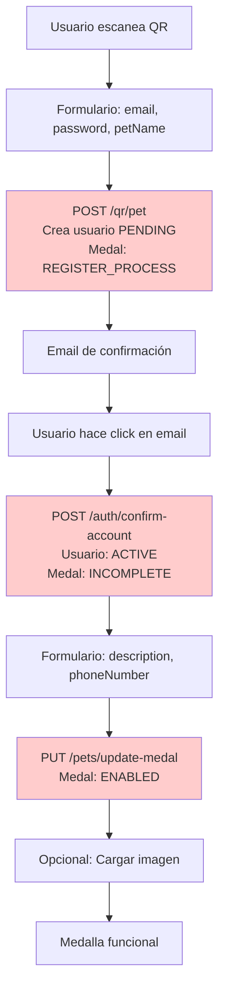
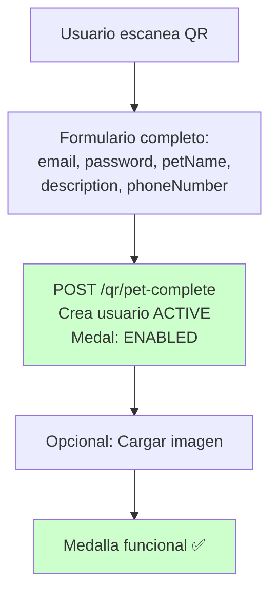

# 🚀 Propuesta: Carga de Medalla en un Solo Paso

## 📋 Objetivo

Simplificar el flujo de registro para que toda la información de la medalla se pueda cargar en un solo paso, eliminando la necesidad de confirmación por email y pasos intermedios.

---

## 🔍 Análisis del Flujo Actual

### Flujo Actual (Múltiples Pasos)



**Problemas**:
- ❌ 3-4 pasos diferentes
- ❌ Requiere confirmación por email
- ❌ Usuario debe esperar email
- ❌ Flujo fragmentado
- ❌ Múltiples formularios

---

## ✅ Propuesta: Flujo en un Solo Paso

### Flujo Propuesto (Un Solo Paso)



**Ventajas**:
- ✅ 1 solo paso (más 1 opcional para imagen)
- ✅ Sin confirmación por email
- ✅ Usuario puede usar inmediatamente
- ✅ Flujo simple y directo
- ✅ Un solo formulario

---

## 📝 Cambios Propuestos

### 1. Nuevo DTO para Registro Completo

**Archivo**: `backend-vlad/src/qr-checking/dto/qr-checking.dto.ts`

```typescript
export class PostMedalCompleteDto {
    @IsString()
    @IsNotEmpty()
    @IsEmail()
    ownerEmail: string;

    @IsString()
    @IsNotEmpty()
    petName: string;
    
    @IsString()
    @IsNotEmpty()
    medalString: string;

    @IsString()
    @IsNotEmpty()
    password: string;

    // Nuevos campos opcionales para registro completo
    @IsOptional()
    @IsString()
    @MinLength(3)
    @MaxLength(150)
    description?: string;

    @IsOptional()
    @IsString()
    @MinLength(10)
    @MaxLength(13)
    phoneNumber?: string;
}
```

---

### 2. Nuevo Endpoint para Registro Completo

**Archivo**: `backend-vlad/src/qr-checking/qr-checking.controller.ts`

```typescript
@Public()
@Post('pet-complete')
@HttpCode(HttpStatus.CREATED)
registerMedalComplete(@Body() dto: PostMedalCompleteDto): Promise<any> {
    return this.qrService.postMedalComplete(dto);
}
```

---

### 3. Nuevo Método en QrService

**Archivo**: `backend-vlad/src/qr-checking/qr-checking.service.ts`

```typescript
async postMedalComplete(dto: PostMedalCompleteDto): Promise<{ 
    text: string; 
    code: string;
    medal: any;
    tokens?: Tokens;
}> {
    // Verificar que la medalla virgin existe y está disponible
    const virginMedal = await this.prisma.virginMedal.findFirst({
        where: {
            medalString: dto.medalString 
        }
    });
    
    if (!virginMedal) throw new NotFoundException('No se encontro la medalla');
    if (virginMedal.status !== MedalState.VIRGIN) {
        throw new NotFoundException('Esta medalla ya no esta disponible para registrar');
    }
    
    // Verificar si el usuario ya existe
    const existingUser = await this.prisma.user.findFirst({
        where: {
            email: dto.ownerEmail.toLowerCase()
        },
        include: {
            medals: true
        }
    });

    // Usar transacción para crear todo en un solo paso
    const result = await this.prisma.$transaction(async (tx) => {
        let user;
        
        // Si el usuario no existe, crearlo como ACTIVE directamente
        if (!existingUser) {
            const hash = await this.hashData(dto.password);
            
            user = await tx.user.create({
                data: {
                    email: dto.ownerEmail.toLowerCase(),
                    hash,
                    userStatus: UserStatus.ACTIVE, // ✅ Directamente ACTIVE
                    role: Role.VISITOR,
                    phonenumber: dto.phoneNumber || null,
                    hashToRegister: null, // No necesario si no hay confirmación
                }
            });
        } else {
            // Si el usuario existe, actualizar teléfono si se proporciona
            if (dto.phoneNumber) {
                user = await tx.user.update({
                    where: { id: existingUser.id },
                    data: { phonenumber: dto.phoneNumber }
                });
            } else {
                user = existingUser;
            }
        }

        // Crear medalla directamente como ENABLED
        const medal = await tx.medal.create({
            data: {
                status: MedalState.ENABLED, // ✅ Directamente ENABLED
                registerHash: virginMedal.registerHash,
                medalString: virginMedal.medalString,
                petName: dto.petName,
                description: dto.description || null,
                owner: {
                    connect: {
                        id: user.id
                    }
                }
            }
        });

        // Actualizar virgin medal
        await tx.virginMedal.update({
            where: { medalString: virginMedal.medalString },
            data: { status: MedalState.ENABLED }
        });

        return { user, medal };
    }, {
        timeout: 20000
    });

    // Generar tokens si es usuario nuevo (para login automático)
    let tokens: Tokens | undefined;
    if (!existingUser) {
        const authService = this.moduleRef.get(AuthService, { strict: false });
        tokens = await authService.getToken(result.user.id, result.user.email, result.user.role);
        await authService.updateRtHash(result.user.id, tokens.refresh_token);
    }

    return {
        text: 'Medalla registrada exitosamente. ¡Tu mascota ya está protegida!',
        code: 'medal_complete',
        medal: result.medal,
        tokens // Para login automático si es usuario nuevo
    };
}
```

---

### 4. Actualizar Formulario Frontend

**Archivo**: `frontend/src/app/pages/add-pet/add-pet.component.ts`

```typescript
registerForm: FormGroup = new FormGroup({
    petName: new FormControl('', [Validators.required, Validators.minLength(3), Validators.maxLength(35)]),
    ownerEmail: new FormControl('', [Validators.required, Validators.email]),
    password: new FormControl('', [
        Validators.required,
        Validators.minLength(8),
        Validators.maxLength(50),
        leastOneCapitalLetterValidator(),
        leastOneLowerCaseValidator(),
        leastOneNumberValidator()
    ]),
    passwordConfirm: new FormControl('', [Validators.required]),
    // Nuevos campos opcionales
    description: new FormControl('', [
        Validators.minLength(3), 
        Validators.maxLength(150)
    ]),
    phoneNumber: new FormControl('', [
        Validators.minLength(10), 
        Validators.maxLength(13)
    ]),
}, { validators: confirmedValidator('password', 'passwordConfirm') });

register() {
    if (!isPlatformBrowser(this.platformId)) return;

    let body: any = this.registerForm.value;
    body.medalString = this.medalString;
    delete body.passwordConfirm;
    
    this.spinner = true;
    this.spinnerMessage = 'Registrando medalla...';

    // Usar nuevo endpoint
    let authSubscription: Subscription = this.qrService.medalRegisterComplete(body).subscribe({
        next: (res: any) => {
            this.spinner = false;
            
            // Si hay tokens, hacer login automático
            if (res.tokens) {
                this.authService.setTokens(res.tokens);
            }
            
            // Redirigir a página de éxito o a la medalla
            this.router.navigate(['/mi-mascota/' + this.medalString], {
                queryParams: { registered: true }
            });
        },
        error: (error: any) => {
            this.spinner = false;
            // Manejo de errores...
        }
    });
    this.addSubscription(authSubscription);
}
```

---

### 5. Actualizar Servicio Frontend

**Archivo**: `frontend/src/app/services/qr-checking.service.ts`

```typescript
medalRegisterComplete(registerObject: MedalRegisterCompleteInterface) {
    return this.http.post(
        `${environment.perrosQrApi}qr/pet-complete`, 
        registerObject, 
        this.getHeaders()
    );
}
```

---

## 🎯 Opciones de Implementación

### Opción A: Modo Completo (Recomendado)

**Características**:
- ✅ Todos los campos opcionales
- ✅ Si se proporcionan todos, medalla queda ENABLED
- ✅ Si faltan campos, medalla queda INCOMPLETE (pero usuario ACTIVE)
- ✅ Usuario puede completar después si quiere

**Ventajas**:
- Flexible: permite registro rápido o completo
- No rompe flujo existente
- Usuario puede usar inmediatamente

---

### Opción B: Modo Estricto

**Características**:
- ✅ Todos los campos requeridos
- ✅ Medalla siempre queda ENABLED
- ✅ Sin pasos intermedios

**Ventajas**:
- Más simple
- Sin estados intermedios

**Desventajas**:
- Formulario más largo
- Puede ser abrumador para algunos usuarios

---

### Opción C: Híbrido (Mejor de ambos mundos)

**Características**:
- ✅ Campos esenciales requeridos: email, password, petName
- ✅ Campos opcionales: description, phoneNumber
- ✅ Si tiene todos → ENABLED
- ✅ Si faltan opcionales → INCOMPLETE (pero usuario ACTIVE)
- ✅ Usuario puede completar después sin confirmación

**Ventajas**:
- Balance entre simplicidad y completitud
- Permite registro rápido
- Permite completar después

---

## 📊 Comparación de Flujos

| Aspecto | Flujo Actual | Flujo Propuesto (Opción C) |
|---------|--------------|----------------------------|
| **Pasos** | 3-4 pasos | 1 paso (+ imagen opcional) |
| **Confirmación email** | ✅ Requerida | ❌ No necesaria |
| **Tiempo hasta funcional** | 5-10 minutos | Inmediato |
| **Formularios** | 2-3 formularios | 1 formulario |
| **Estados intermedios** | PENDING → INCOMPLETE → ENABLED | ACTIVE → ENABLED (o INCOMPLETE) |
| **Complejidad** | Alta | Baja |
| **UX** | Fragmentada | Fluida |

---

## 🔄 Migración Gradual

### Estrategia: Mantener Ambos Flujos

1. **Fase 1**: Implementar nuevo endpoint `POST /qr/pet-complete`
2. **Fase 2**: Actualizar frontend para usar nuevo endpoint
3. **Fase 3**: Mantener endpoint antiguo por compatibilidad
4. **Fase 4**: Deprecar endpoint antiguo después de período de transición
5. **Fase 5**: Eliminar endpoint antiguo

### Compatibilidad

- ✅ Endpoint antiguo sigue funcionando
- ✅ Usuarios existentes no afectados
- ✅ Migración opcional para nuevos usuarios

---

## ⚠️ Consideraciones

### Seguridad

**Problema**: Sin confirmación de email, ¿cómo validamos que el email es real?

**Soluciones**:
1. **Validación de dominio**: Verificar que el dominio del email existe
2. **Rate limiting**: Limitar registros por IP/email
3. **Verificación opcional**: Permitir verificar email después (sin bloquear uso)
4. **Captcha**: Prevenir bots

### Validación de Email

```typescript
// Agregar validación de dominio
async validateEmailDomain(email: string): Promise<boolean> {
    const domain = email.split('@')[1];
    try {
        await dns.resolveMx(domain);
        return true;
    } catch {
        return false;
    }
}
```

### Spam/Abuso

- Limitar registros por IP (ej: 5 por hora)
- Limitar registros por email (ej: 3 por día)
- Monitorear patrones sospechosos

---

## 📝 Implementación Recomendada

### Opción C: Híbrido (Recomendado)

**Flujo**:
1. Usuario completa formulario con campos esenciales
2. Campos opcionales (description, phoneNumber) pueden dejarse vacíos
3. Si todos los campos están → Medalla ENABLED
4. Si faltan opcionales → Medalla INCOMPLETE pero usuario ACTIVE
5. Usuario puede completar después sin confirmación

**Código de ejemplo**:

```typescript
// En postMedalComplete()
const hasAllFields = !!(dto.description && dto.phoneNumber);
const medalStatus = hasAllFields ? MedalState.ENABLED : MedalState.INCOMPLETE;

const medal = await tx.medal.create({
    data: {
        status: medalStatus,
        registerHash: virginMedal.registerHash,
        medalString: virginMedal.medalString,
        petName: dto.petName,
        description: dto.description || null,
        owner: {
            connect: { id: user.id }
        }
    }
});

// Actualizar virgin medal
await tx.virginMedal.update({
    where: { medalString: virginMedal.medalString },
    data: { status: medalStatus }
});
```

---

## ✅ Beneficios

1. **UX Mejorada**: Usuario puede usar inmediatamente
2. **Menos Fricción**: Sin esperar emails
3. **Flujo Simple**: Un solo paso
4. **Menos Errores**: Menos puntos de fallo
5. **Más Conversión**: Menos pasos = más completan el registro

---

## 🚀 Próximos Pasos

1. ⏳ Decidir opción (A, B o C - recomendamos C)
2. ⏳ Implementar nuevo endpoint
3. ⏳ Actualizar frontend
4. ⏳ Agregar validaciones de seguridad
5. ⏳ Testing exhaustivo
6. ⏳ Deploy gradual

---

## 📊 Resumen

**Pregunta**: ¿Se puede cargar toda la medalla de un solo paso?

**Respuesta**: ✅ **SÍ, definitivamente**

**Recomendación**: Implementar **Opción C (Híbrido)** que permite:
- Registro rápido con campos esenciales
- Completar información opcional después
- Sin necesidad de confirmación por email
- Usuario activo inmediatamente
- Medalla funcional desde el inicio (o casi)

**Impacto**: Reducción de 3-4 pasos a 1 paso, mejorando significativamente la UX.


