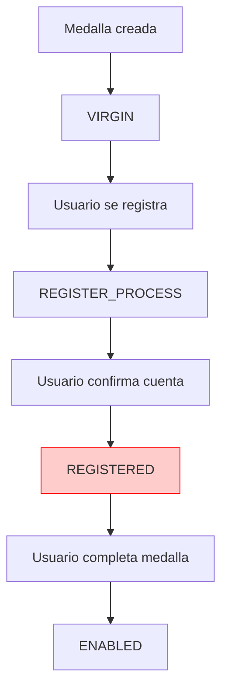

# 🔍 Análisis de Estados de Medallas - Bug Crítico Identificado

## 📋 Resumen

**Fecha**: 2025-01-27  
**Severidad**: CRÍTICA  
**Estado**: 🔍 **ANALIZANDO**  

## 🚨 Bug Identificado: Inconsistencia en Estados de Virgin Medals

### **El Problema**

Hay una **inconsistencia crítica** en el flujo de estados de `virgin_medals`:

1. **REGISTERED** se usa cuando el usuario confirma su cuenta (línea 122 en `auth.service.ts`)
2. **ENABLED** se usa cuando la medalla está completamente funcional
3. **Pero REGISTERED no tiene sentido funcional** - es un estado intermedio confuso

### **Flujo Actual Problemático**



### **Estados Actuales de MedalState**

```typescript
enum MedalState {
  VIRGIN                    // ✅ Medalla recién creada
  ENABLED                   // ✅ Medalla completamente funcional
  DISABLED                  // ✅ Medalla deshabilitada
  DEAD                      // ✅ Medalla eliminada
  REGISTER_PROCESS          // ✅ En proceso de registro
  PENDING_CONFIRMATION      // ✅ Pendiente de confirmación
  INCOMPLETE               // ✅ Registro incompleto
  REGISTERED               // ❌ ESTADO CONFUSO - ¿Para qué sirve?
}
```

## 🔍 Análisis del Código

### **1. Confirmación de Cuenta (auth.service.ts:122)**

```typescript
// Línea 122: Se cambia a REGISTERED cuando usuario confirma cuenta
await tx.virginMedal.update({
    where: { medalString: dto.medalString },
    data: { status: MedalState.REGISTERED }  // ❌ ¿Por qué REGISTERED?
});
```

### **2. Confirmación de Medalla (auth.service.ts:151)**

```typescript
// Línea 151: Se cambia a ENABLED cuando medalla se completa
await tx.virginMedal.update({
    where: { medalString: dto.medalString },
    data: { status: MedalState.ENABLED }  // ✅ Esto tiene sentido
});
```

## 🤔 Preguntas Críticas

### **1. ¿Cuál es la diferencia entre REGISTERED y ENABLED?**

- **REGISTERED**: Usuario confirmó cuenta, pero medalla no está completa
- **ENABLED**: Medalla completamente funcional

**Problema**: ¿Por qué no usar INCOMPLETE en lugar de REGISTERED?

### **2. ¿Qué pasa con medallas en estado REGISTERED?**

- ¿Pueden ser escaneadas?
- ¿Qué funcionalidad tienen?
- ¿Es un estado intermedio necesario?

### **3. ¿Hay inconsistencias en el flujo?**

```typescript
// Flujo actual:
VIRGIN → REGISTER_PROCESS → REGISTERED → ENABLED

// ¿Debería ser?
VIRGIN → REGISTER_PROCESS → INCOMPLETE → ENABLED
```

## 🔧 Posibles Soluciones

### **Opción 1: Eliminar REGISTERED**
```typescript
// Cambiar línea 122 de:
status: MedalState.REGISTERED
// A:
status: MedalState.INCOMPLETE
```

### **Opción 2: Clarificar el propósito de REGISTERED**
- Documentar exactamente qué significa REGISTERED
- Definir cuándo se debe usar vs INCOMPLETE

### **Opción 3: Revisar todo el flujo**
- Analizar si REGISTERED es realmente necesario
- Simplificar el flujo de estados

## 📊 Impacto del Bug

### **Problemas Identificados**

1. **Confusión conceptual**: REGISTERED vs INCOMPLETE
2. **Inconsistencia**: Dos estados para el mismo concepto
3. **Mantenimiento**: Código más complejo de lo necesario
4. **Debugging**: Difícil entender el flujo de estados

### **Riesgos**

- Medallas atrapadas en estado REGISTERED
- Lógica de negocio confusa
- Posibles bugs en el frontend al manejar estados

## 🎯 Recomendación

**Eliminar el estado REGISTERED** y usar INCOMPLETE en su lugar:

```typescript
// ANTES (confuso)
status: MedalState.REGISTERED

// DESPUÉS (claro)
status: MedalState.INCOMPLETE
```

## 🏷️ Tags

`bug-analysis` `medal-states` `virgin-medals` `state-inconsistency` `critical`
