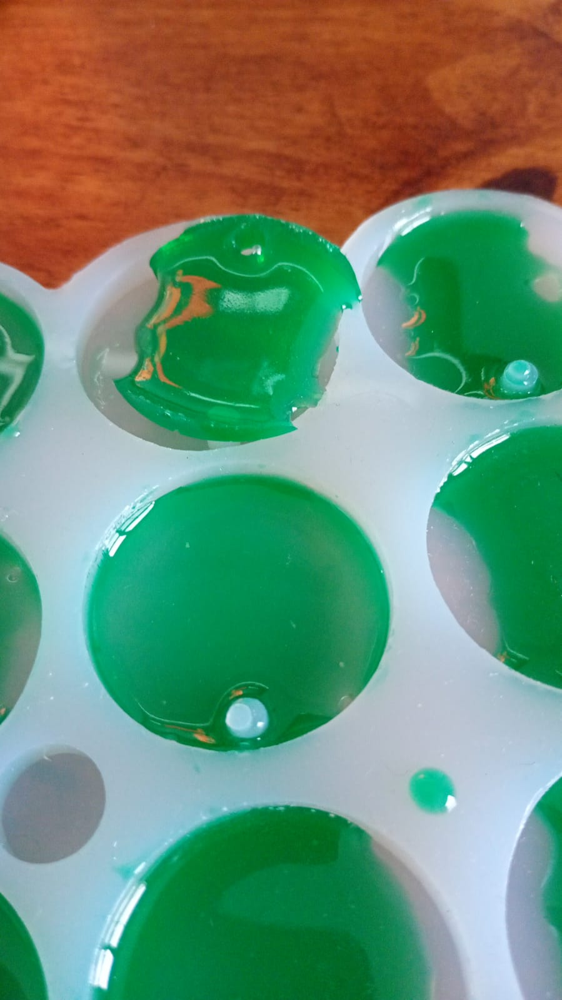
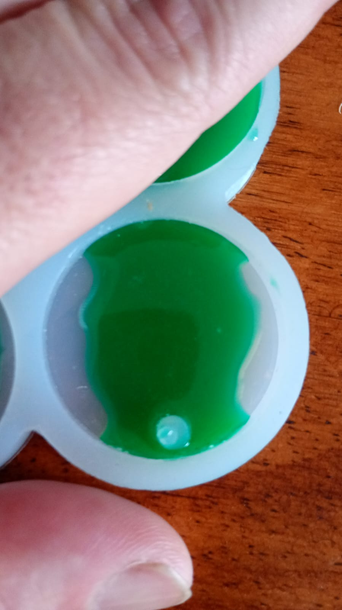
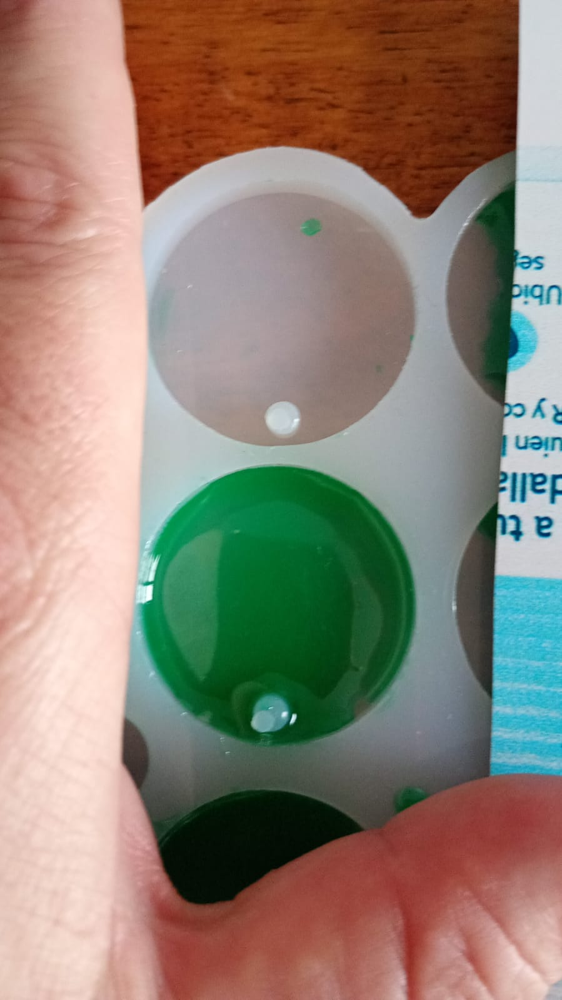
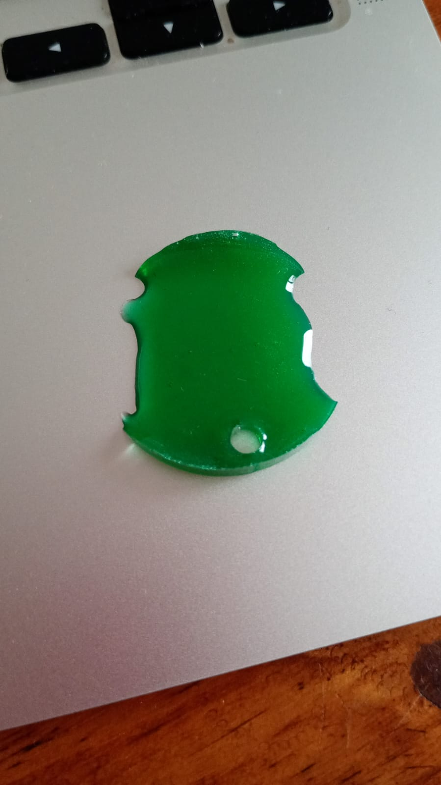

# Prueba de Capa del Medio - Resina

## Primera Prueba

### Descripción
Esta fue la primera prueba realizada para crear una capa del medio utilizando resina epoxi. El objetivo es lograr que la resina fluya correctamente entre las dos capas de stickers, permitiendo que la resina de la capa superior pueda pasar a través de la capa del medio hacia la capa inferior.

### Concepto de la Capa del Medio
La capa del medio debe estar diseñada de manera que permita el flujo de resina entre las dos caras del molde. Esta capa contiene stickers pegados en ambos lados, por lo que necesita tener aberturas o canales que permitan que la resina fluya de una capa a otra.

### Materiales Utilizados
- **Resina epoxi**: Aproximadamente 15 gramos
- **Stickers**: Pegados en ambos lados de la capa del medio
- **Molde**: Con tres capas (superior, media, inferior)

### Imágenes de Referencia

#### 1. Capa del Medio - Vista General

*Imagen de la capa del medio que muestra la estructura general*

#### 2. Medalla que Permite el Flujo Correcto

*Ejemplo de diseño que permite el flujo correcto de resina*

#### 3. Medalla que NO Permite el Flujo Correcto

*Ejemplo de diseño problemático donde la superficie ocupa todo el espacio*

#### 4. Imagen de Ejemplo Inicial

*Imagen de referencia para el diseño inicial*

### Proceso
1. **Preparación**: Se midieron aproximadamente 15 gramos de resina
2. **Diseño de la Capa del Medio**: Crear aberturas o canales que permitan el flujo de resina
3. **Aplicación de Stickers**: Pegar stickers en ambos lados de la capa del medio
4. **Ensamblado del Molde**: Colocar las tres capas en el orden correcto
5. **Aplicación de Resina**: Verter la resina en la capa superior
6. **Curado**: Permitir que la resina fluya y cure completamente

### Resultados
- **Estado final**: [Describir el resultado obtenido]
- **Flujo de Resina**: [Evaluar si la resina fluyó correctamente entre capas]
- **Observaciones**: [Notas importantes sobre el proceso]
- **Aprendizajes**: [Lo que se aprendió de esta primera prueba]

### Notas Adicionales
- **Fecha de la prueba**: [Especificar fecha]
- **Condiciones ambientales**: [Temperatura, humedad, etc.]
- **Tiempo de trabajo**: [Tiempo disponible antes del gel]
- **Importancia del Flujo**: La capa del medio debe permitir que la resina fluya libremente entre las capas superior e inferior

### Próximos Pasos
- [Listar mejoras o ajustes para futuras pruebas]
- [Consideraciones para la siguiente iteración]
- [Optimización del diseño de aberturas en la capa del medio]
